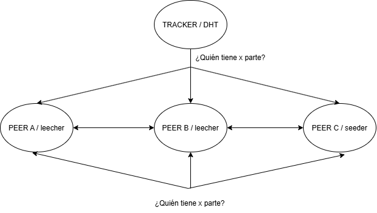

# Análisis de caso: BitTorrent

**Equipo:** andler-soto  ·  **Fecha:** 04-09-2026

## 1. Modelo dominante
El modelo dominante es P2P, porque los nodos actúan como peer, cada peer puede descargar y compartir trozos del archivo con cada peer

Justificación con las preguntas de la matriz (marcar la que más pesó):
- **¿Quién manda?:** Nadie
- **¿Los nodos son parecidos?:** Si, simetricos
- **¿Qué tan lejos están?:** Internet
- **¿Qué pasa si uno desaparece?:** Si el seeder desaparece, los demás peers pueden seguir compartiendo el archivo, pero solo si entre todos todavía tienen todos los trozos

## 2. Nodos y roles
| Nodo | Rol | ¿Cuántos? | ¿Estado o sin estado? |
|---|---|---|---|
| Seeder | Tiene el archivo completo y comparte sus trozos | Uno o más | Con estado |
| Leecher | Descarga y comparte los trozos que ya posee | Muchos | Con estado |
| Tracker | Mantiene información sobre los peers que participan | Uno o más | Sin estado |
| DHT | Alternativa al tracker donde no dependen de un servidor central | Muchos | Sin estado |

## 3. Diagrama de interacciones

El diagrama muestra la interacción entre el Tracker/DHT y los peers de la red  
Los peers pueden actuar como leechers mientras descargan el archivo y como seeders cuando poseen el archivo completo

## 4. Desafío dominante
**Seguridad:** Los peers no son son confiables, pueden haber datos corruptos o contaminados

¿Cómo lo resuelve el sistema?: Mediante hash por trozos verificando que lo recibido corresponda  
¿Qué falacia de la Semana 2 estaría asumiendo si no lo hiciera?: La red no es segura

## 5. ¿Qué pasa si cae X?
**Nodo elegido:** Último seeder
- **Qué siguen viendo los usuarios:** Los peers pueden seguir compartiendo los trozos que ya poseen
- **Qué deja de funcionar:** Si algún trozo solo estaba disponible en el úlitmo seeder, no se podrá completar el archivo
- **¿El sistema elige responder (AP) o no equivocarse (CP)? ¿Cómo lo saben?:** AP porque el sistema prioriza seguir funcionando con los peers y trozos disponibles aunque el archivo completo pueda dejar de estar disponible

## 6. La desventaja que vamos a defender
**La disponibilidad:** Depende de que los peers tengan en archivo completo en conjunto, si falta alguna parte, no se puede repartir
